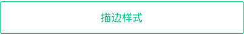

# Button

> 按钮组件，支持禁用及加载中、点击响应等功能。

## 用法

```javascript
import Button from '@codoonfxd/crn-elements/dist/Button';

export const Demo = () => {
  return <Button title="按钮1" />;
};
```

注意：按钮容器的默认宽度为屏幕宽度，默认高度为 50，默认的颜色为咕咚主题色`#00bc71`，`paddingLeft`和`paddingRight`默认为`12`。

## 示例

### 绑定点击事件

```javascript
import Button from '@codoonfxd/crn-elements/dist/Button';

export const Demo = () => {
  return (
    <Button
      title="绑定点击事件"
      onPress={() => {
        console.log('点击了按钮');
      }}
    />
  );
};
```

### 禁用与加载中状态


```javascript
import Button from '@codoonfxd/crn-elements/dist/Button';

export const Demo = () => {
  return (
    <View>
      <Button title="禁用" disabled />
      <Button title="加载中" loading />
    </View>
  );
};
```

### 自定义样式

```javascript
import Button from '@codoonfxd/crn-elements/dist/Button';

export const Demo = () => {
  return (
    <Button
      title="自定义样式"
      style={{ backgroundColor: '#eee', width: 240 }}
      textStyle={{ color: '#333' }}
    />
  );
};
```

### 适配 iPhone X 的底部 bar 空间


```javascript
import Button from '@codoonfxd/crn-elements/dist/Button';

export const Demo = () => {
  return <Button title="我是按钮" showBottomSpace />;
};
```

### 使用描边样式



```javascript
import Button from '@codoonfxd/crn-elements/dist/Button';

export const Demo = () => {
  return <Button title="描边样式" ghost />;
};
```

## Props

|      参数       |                   说明                    |      类型       | 可选值 |  默认值   |
| :-------------: | :---------------------------------------: | :-------------: | :----: | :-------: |
|      title      |               按钮上的文字                | React.ReactNode |   -    |   必填    |
|      style      | 按钮样式(默认高度 50，默认宽度为屏幕宽度) |    ViewStyle    |   -    |    {}     |
|    textStyle    |     文字样式，title 为字符串时才有效      |    TextStyle    |   -    |    {}     |
|    disabled     |                 是否禁用                  |     boolean     |   -    |   false   |
|     loading     |            是否展示加载中状态             |     boolean     |   -    |   false   |
| showBottomSpace |       是否留出 iPhone X 底部的空间        |     boolean     |   -    |   false   |
|     onPress     |             点击时触发的函数              |    function     |   -    | undefined |
|      ghost      |             是否使用描边样式              |     boolean     |   -    |   false   |
|  numberOfLines  |    按钮文字显示行数，即 Text 的该属性     |     number      |   -    |     1     |
