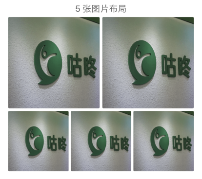

# Gallery

> 九宫格相册展示组件

## 用法

```javascript
import Gallery from '@codoonfxd/crn-elements/dist/Gallery';

export const Demo = () => {
  return (
    <Gallery
      dataList={[{ url: 'path/to/image' }]}
      activeOpacity={0.9}
      style={{ backgroundColor: '#f3f3f3' }}
      pictureStyle={{ borderRadius: 8 }}
      onPress={idx => {
        console.log(idx);
      }}
      gap={12}
    />
  );
};
```

## 示例

该组件会根据传入的`dataList`长度自动选择渲染的布局，所有的布局样式如下：





## Props

|     参数      |                     说明                     |      类型      | 可选值 |  默认值   |
| :-----------: | :------------------------------------------: | :------------: | :----: | :-------: |
|   dataList    |                    数据源                    | IGalleryUrl[]  |   -    |   必填    |
|      gap      |               组件与两侧的距离               |     number     |   -    |    16     |
|    padding    |             与屏幕两端之间的距离             |     number     |   -    |     5     |
|     type      |            分为铺满与平铺两种类型            |     string     |  full  |   tile    | full |
|    oneLine    | 是否只一行展示图片（仅 type 为 tile 时可用） |    boolean     |        |   false   |
|  renderExtra  |         在图片库容器中渲染自定义内容         |   ReactNode    |        |   null    |
|     style     |            组件最外层的自定义样式            |   ViewStyle    |   -    |    {}     |
| activeOpacity |              图片点击时的透明度              |     number     |   -    |    0.7    |
| pictureStyle  |             图片组件的自定义样式             |    boolean     |   -    |   false   |
|    onPress    |  图片点击时的回调，index 为点击图片的索引值  | (index) => any |   -    | undefined |
