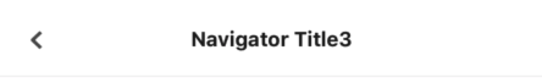
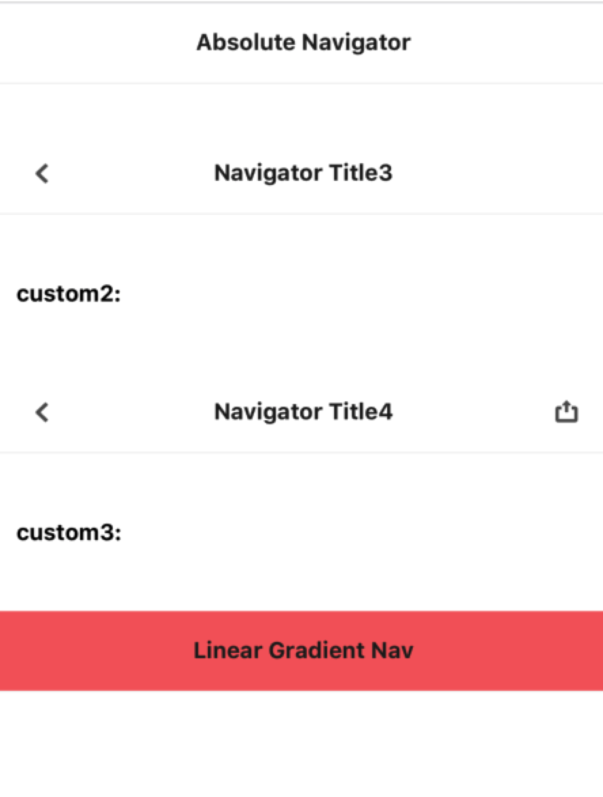

# Navigator

> 导航栏组件

### 事项

- 导航栏分为三部分，左边按钮，中间 title, 右边按钮，如果左右按钮不传，则默认显示标题
- 支持绝对定位导航栏
- 按钮支持 React Element 和 React Component 两种形式传递 children
- 支持默认左边返回按钮
- 支持自定义左右内容样式和标题样式

## 用法

```javascript
import { Navigator } from "@codoonfxd/crn-elements";
<Navigator
  title="Navigator Title4"
  rightButton={
    <TouchableOpacity>
      <Image
        source={{ uri: '' }}
        style={{ width: 20, height: 20 }}
      />
    </TouchableOpacity>
  }
/>
```

## Demo

- default



- custom


- absolute



## API

### Props

| 属性        | 说明              | 类型             | 默认值 | 必选  |
| ----------- | ----------------- | ---------------- | ------ | ----- |
| title       | 导航栏标题        | string           | ''     | true  |
| style       | 导航栏样式        | ViewStyle        | --     | false |
| titleStyle  | 导航栏标题样式    | ViewStyle        | --     | false |
| absolute    | 是否开启绝对定位  | boolean          | false  | false |
| rightButtonStyle  | 导航栏右边容器样式 | ViewStyle | --     | false |
| rightButton | 导航栏右侧显示组件 | ReactNode/React.Component | --     | false |
| leftButtonStyle | 导航栏左侧容器样式 | ViewStyle | --     | false |
| leftButton | 导航栏左侧显示组件 | ReactNode/React.Component | --     | false |
