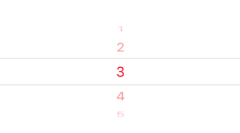
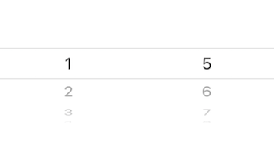

# PickerView

> 滑动选择组件，支持多个选择列表传入

## 用法

```javascript
import PickerView from '@codoonfxd/crn-elements/dist/PickerView';

export const Demo = () => {
  return (
    <PickerView
      itemStyle={{color: 'red'}}
      pickerData={[1,2,3,4,5,6,7,8,9,10]}
      selectedValue={[3]}
      onValueChange={(pick,index) => this.onValueChange(pick,index)} />
  )
};
```

注意：组件容器的默认宽度为屏幕宽度 / 选择项个数

## 示例

### 滑动选择
单个选择



多个选择



```javascript
import PickerView from '@codoonfxd/crn-elements/dist/PickerView';

export const Demo = () => {
  onValueChange(pick,index) {
    console.log(pick,index)
  }
  return (
    <PickerView
      pickerStyle={{backgroundColor: '#eee'}}
      itemStyle={{color: 'red'}}
      pickerData={[1,2,3,4,5]}
      selectedValue={[3]}
      onValueChange={(pick,index) => this.onValueChange(pick,index)} />
  )
};
```

## Props

|      参数       |                   说明                    |      类型       | 可选值 |  默认值   |
| :-------------: | :---------------------------------------: | :-------------: | :----: | :-------: |
|    pickerStyle  |   picker 样式 |    ViewStyle    |   -    |    {}     |
|    itemStyle     |   选项样式     |    TextStyle    |   -    |    {}     |
|    selectedValue    |       初始值     |     [any]     |   -    |   -   |
|     onValueChange  |       选择项函数        |    function     |   -    | undefined |
